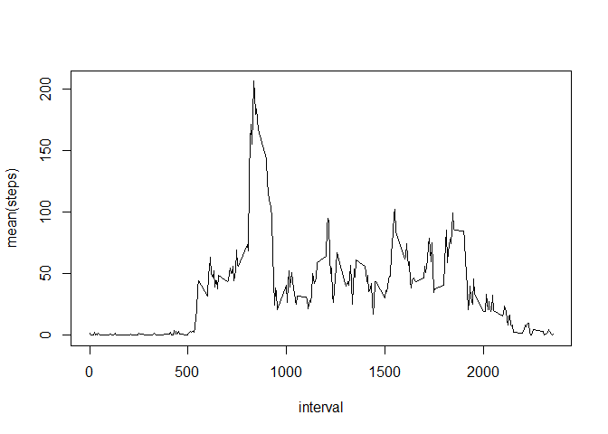
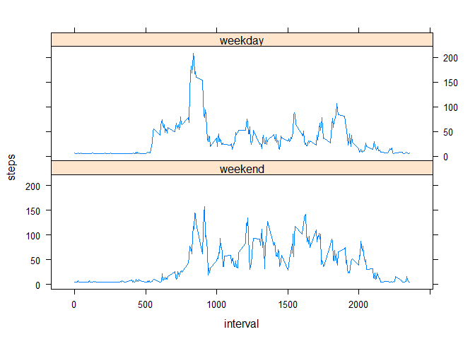

## Loading and preprocessing the data.
data = frames with NA's, data1 = without NA's

```r
setwd("D:/Users/Gerjan/R/RepResearch/RR-wk1/activity")
data <- read.csv("activity.csv")
setwd("D:/Users/Gerjan/R/RepResearch/RR-wk1")

good<-complete.cases(data)
data1<-data[good,]
```

## What is mean total number of steps taken per day?

```r
library(dplyr)
stepsaday<-data1%>%
  group_by(date) %>%
  summarise(sum(steps))
```
mean steps a day

```r
mean(stepsaday$`sum(steps)`)
```

```
## [1] 10766.19
```
median steps a day

```r
median(stepsaday$`sum(steps)`)
```

```
## [1] 10765
```

## What is the average daily activity pattern?
Time series plot of the 5-minute interval (x-axis) and the average number of steps taken, averaged across all days (y-axis)

```r
stepsainterval<-data1%>%
  group_by(interval) %>%
  summarise(mean(steps))

  plot(stepsainterval,type="l")
```

<!-- -->

The next 5-minute interval, on average across all the days in the dataset, contains the maximum number of steps:

```r
stepsainterval[stepsainterval$`mean(steps)`==max(stepsainterval$`mean(steps)`),]
```

```
## # A tibble: 1 x 2
##   interval `mean(steps)`
##      <int>         <dbl>
## 1      835      206.1698
```
So the 8:35 interval has the most steps

## Imputing missing values
Calculate and report the total number of missing values in the dataset (i.e. the 
total number of rows with NAs)

```r
sum(is.na(data))
```

```
## [1] 2304
```


```r
sum(is.na(data$steps))
```

```
## [1] 2304
```

So there are 2304 NA's, and they are all in the "steps" column


The choosen strategy for filling in all of the missing values in the dataset: taking the overall average steps by interval over the total data set, and replace the NA's with that number. 

So the new dataset data2 that is equal to the original dataset but with the missing data filled in:

```r
replaceNAstep<-mean(data1$steps)
data2<-data
data2[is.na(data2)]<-replaceNAstep
```


Make a histogram of the total number of steps taken each day  

```r
library(ggplot2)
```


```r
names(stepsaday)[2]<-"steps"
stepsaday$date<-as.Date(stepsaday$date)
g<-ggplot(stepsaday,aes(date,steps))
g+geom_col()
```

<!-- -->

Calculate and report the mean and median total number of steps taken per day.

```r
library(dplyr)
stepsaday<-data2%>%
  group_by(date) %>%
  summarise(sum(steps))
```
mean steps a day with imputed NA's:

```r
mean(stepsaday$`sum(steps)`)
```

```
## [1] 10766.19
```
median steps a day with imputed NA's:

```r
median(stepsaday$`sum(steps)`)
```

```
## [1] 10766.19
```
Only the median value differs from the estimates from the first part of the assignment. Impact is not much, because I took as a replacement the average value.

## Are there differences in activity patterns between weekdays and weekends?
For this part the weekdays() function may be of some help here. Use the dataset with the filled-in missing values for this part.

Create a new factor variable in the dataset with two levels - "weekday" and "weekend" indicating whether a given date is a weekday or weekend day:

```r
data3<-data2
data3$date<-as.Date(data3$date)
weekdays1 <- c('Monday', 'Tuesday', 'Wednesday', 'Thursday', 'Friday')
data3$factorwd <- factor((weekdays(data3$date) %in% weekdays1), 
                   levels=c(FALSE, TRUE), labels=c('weekend', 'weekday'))


stepsainterval2<-data3%>%
  group_by(factorwd,interval) %>%
  summarise(mean(steps))

names(stepsainterval2)[3]<-"steps"
```

Make a panel plot containing a time series plot (i.e. type = "l") of the 5-minute interval (x-axis) and the average number of steps taken, averaged across all weekday days or weekend days (y-axis).

```r
library(lattice)                  
xyplot(steps ~ interval| factorwd, data = stepsainterval2,type='a', layout = c(1,2))
```

<!-- -->

According to the figure there are differences in weekends and weekdays; peaks in weekends are lower, but steps are mor equal distibuted in weekends

